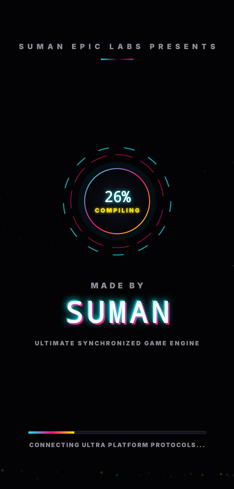
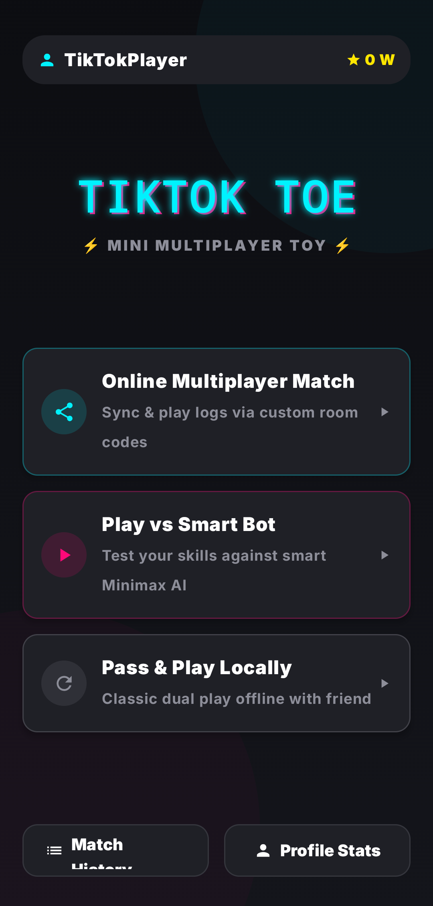

# 🕹️ TikTok Toe - Mini Multiplayer Toy
**Presented by Suman Epic Labs**

TikTok Toe is a modern, neon-infused reimagining of the classic Tic-Tac-Toe game. Built with an "Ultimate Synchronized Game Engine," it features a stunning cyberpunk-inspired dark mode UI, real-time multiplayer lobbies, and an unbeatable AI opponent.
---
## ✨ Epic Features
### 🎮 Three Distinct Game Modes
* **🌐 Online Multiplayer Match:** Connect with friends globally. Generate a custom 6-digit room code, share it, and play in real-time with live sync status.
* **🤖 Play vs Smart Bot:** Test your skills against a highly intelligent AI powered by the Minimax algorithm. 
* **🤝 Pass & Play Locally:** The classic dual-play offline experience for when you are sitting right next to your friend.
### 🎨 Next-Level UI/UX
* **Neon Dark Theme:** Gorgeous glowing aesthetics, fluid enter animations, and a sleek modern glass/neon hybrid interface perfectly optimized for mobile screens.
* **In-Game Reactions:** Express yourself during the match with a built-in live emoji reaction dock (😂, 🔥, 😭, 😮, 💖).
### 📊 Player Profiles & Stats
* **Custom Nicknames:** Personalize your display name.
* **Lifetime Tracking:** Automatically records your Wins, Losses, Draws, and tracks your Active Winning Streak across sessions. 
---
## 📸 Screenshots

| Splash Screen | Main Menu | Multiplayer Setup |
| :--- | :--- | :--- |
|  |  |  |

| Gameplay Board | Profile & Stats |
| :--- | :--- |
|  |  |

---
## 🚀 How to Install & Play (Android)
You don't need to compile the code yourself to play! 
1. Navigate to the **[Releases](#)** or **Actions** tab of this repository.
2. Download the latest `TicTacToe-APK.zip` file.
3. Extract the `.zip` file on your Android device.
4. Tap the `app-debug.apk` file to install it. *(Note: You may need to enable "Install from Unknown Sources" in your Android settings).*
5. Launch **TikTok Toe** and start playing!
---
## 🛠️ Technical Architecture & Build Process
This application was developed as a native Android project and utilizes a fully automated cloud-build pipeline.
* **Build System:** Gradle (Version 9.5.1)
* **CI/CD Pipeline:** Fully automated via **GitHub Actions**. Every push to the main branch triggers a cloud server (Ubuntu) to set up Java 17, provision the Android SDK, automatically generate debug keystores, and compile a fresh `.apk` artifact ready for download.
* **AI Integration:** Single-player mode features a programmatic Minimax decision-making algorithm to ensure competitive gameplay.
---

👨‍💻 Author
Suman M
⭐ If you enjoyed this project, consider giving the repository a star on GitHub!
